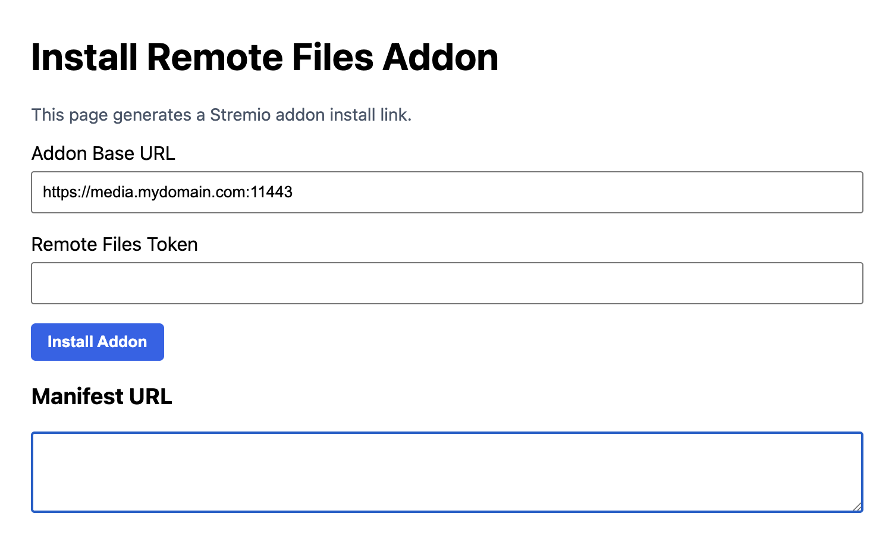
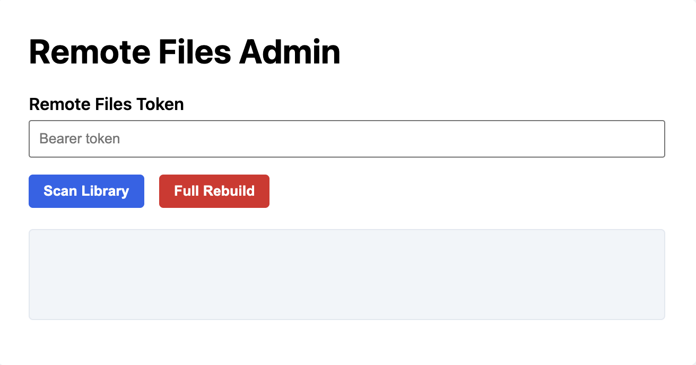

# Stremio Remote Files Addon

Self-hosted Stremio addon that indexes a **remote movie and series library** and serves streams over:

- **LAN / VPN (HTTP)**
- **WAN / Internet (HTTPS)** with token-based protection for stream discovery and resolution

Stremio includes a “Local Files” addon for playing files stored on a PC.  
However, platforms like **Fire TV sticks, Android TV, and other embedded devices** have no local storage and no way to access local files.

This project runs a small server that:
- Scans and catalogs remote media
- Exposes it to Stremio as a normal addon
- Streams the actual media files back to Stremio over the network

---

## Requirements

Before you begin, you will need:

- **Docker** and **Docker Compose**
- A **TMDB API key** (free)
  - Create one at: https://www.themoviedb.org/settings/api
  - Used to retrieve movie and series metadata (IMDb ID, posters, genres)
- (Optional) A domain name and TLS certificates for external HTTPS access

No Python installation is required on the host system.

---

## Architecture

There are **two services**:

### 1) `stremio-remote-files-api` (FastAPI)

- Scans `/media` and writes metadata to `/data/library.db`
- Exposes **Stremio addon endpoints**:
  - manifests
  - catalogs
  - stream resolvers
  - addon configuration (`/internal/configure`, `/external/configure`)
- Exposes **admin endpoints and UI**:
  - `/admin`
  - `/configure` (human-facing install / configuration page)
  - scan endpoints (manual rescans)

### 2) `stremio-remote-files-proxy` (Caddy)

- Reverse proxies API and admin HTTP routes to the API container
- Serves the **actual media bytes** directly from `/media`
- Terminates HTTPS for all external access
- Does **not** enforce token checks on media byte delivery
- Token enforcement is handled at the **stream resolver API layer**

---

## Media naming

### Movies (`/media/movies`)

Filename format:
```
Title (YEAR).ext
Title (YEAR) [1080p].ext
```

Examples:
```
Night of the Living Dead (1968).mp4
Night of the Living Dead (1968) [1080p].mp4.mp4
```

Rules:
- Year in parentheses is required
- Resolution tag is optional
- Any video extension is accepted

---

### Series (`/media/series`)

Folder / filename format:
```
Series Name/
  Season 01/
    S01E01 - Episode Title.ext
    S01E02 - Episode Title [1080p].ext
```

Examples:
```
Flash Gordon/Season 01/S01E01 - The Planet of Peril.mp4
Flash Gordon/Season 02/S02E03 - A Lesson in Courage [1080p].mp4
```

Rules:
- Season folders must be named `Season <number>`
- Episode files must start with `SxxExx`
- Episode title and resolution tag are optional

---

## Environment file setup (`.env`)

Create `.env` from `.env.sample`.

```env
STREAM_TOKENS=change-me
ADMIN_SCAN_TOKEN=change-me
TMDB_API_KEY=change-me
MEDIA_BASE_URL_INTERNAL=http://internal.ip.address:11080
MEDIA_BASE_URL_EXTERNAL=https://external.host.name:11443
```

### Variable reference

| Variable | Required | Description |
|---|---:|---|
| `STREAM_TOKENS` | Yes | Comma-separated list of tokens used by external Stremio stream resolvers |
| `ADMIN_SCAN_TOKEN` | Yes | Token required for admin scan and rebuild endpoints |
| `TMDB_API_KEY` | Yes | Used for metadata lookups (IMDb ID, posters, genres) |
| `MEDIA_BASE_URL_INTERNAL` | Yes | Base URL used for LAN/VPN streams |
| `MEDIA_BASE_URL_EXTERNAL` | Yes | Base URL used for external HTTPS streams |

### Tokens (single or multiple)

You may specify one or more tokens:

```
STREAM_TOKENS=token1,token2,token3
```

Two separate token types are used:

- **Stream tokens**
  - Used by external Stremio stream resolver endpoints
  - Passed as `?token=` query parameters
  - Invalid tokens return an empty stream list (no errors)

- **Admin token**
  - Used for administrative actions such as media scans and rebuilds
  - Passed as a `Bearer` token in the `Authorization` header
  - Invalid or missing tokens return explicit `401 / 403` errors

Stream tokens **cannot** be used for admin actions, and admin tokens are never accepted for stream resolution.

Tokens are **not required**, including for external access, for:
- Manifests
- Catalog endpoints

---

## Generating a token

### Python
```bash
python3 -c 'import secrets; print(secrets.token_urlsafe(32))'
```

### OpenSSL
```bash
openssl rand -base64 32 | tr -d '='
```

32-byte tokens are sufficient for both stream and admin use; you may generate longer tokens if desired.

---

## Setup / Quickstart

### 1) Configure shared media location

Both containers must mount the same media directory.  
The API container catalogs the media and the proxy serves the media to Stremio.

```yaml
./volumes/stremio-remote-files-shared/media:/media:ro
```

Place media in:
- `./volumes/stremio-remote-files-shared/media/movies`
- `./volumes/stremio-remote-files-shared/media/series`

### 2) Create `.env`

```bash
cp .env.sample .env
# edit values
```

### 3) Add TLS certificates (external HTTPS only)

TLS certificates are only required if you want external HTTPS access.

```
./volumes/stremio-remote-files-proxy/certs/fullchain.pem
./volumes/stremio-remote-files-proxy/certs/privkey.pem
```
If you do not require external HTTPS access to your media, you may comment out or remove the entire "External (HTTPS)" section in the Caddyfile:
```
./volumes/stremio-remote-files-proxy/Caddyfile
```

This disables all external WAN access while keeping LAN/VPN access intact.

### 4) Ports, DNS, firewall

Defaults:
- Internal HTTP: `11080`
- External HTTPS: `11443`

If you change ports:
- Update `MEDIA_BASE_URL_INTERNAL` and `MEDIA_BASE_URL_EXTERNAL`  

If you do expose this plugin externally:
- Update your routers firewall rules
- Update your DNS if using a hostname

### 5) Start containers

```bash
docker compose up -d --build
```

### 6) Configure addon for Stremio

Open in a browser:
- Internal: http://<internal.ip.address>:11080/configure — Configure the addon over HTTP (LAN / VPN)
- External: https://<external.host.name>:11443/configure — Configure the addon over HTTPS with token authentication

A configuration web page will be displayed.  



Fill in the required fields:
- **Addon Base URL**  
Defaults to the URL used to access the configure page.
- **Stream Token**  
Only visible when accessing the page via HTTPS.
Use any token defined in `STREAM_TOKENS` in the `.env` file.

Click **Install Addon**:
- You will be prompted to open Stremio to install the addon
- The manifest URL is displayed in case automatic installation fails

In Stremio:
- Discover → Movies → **Remote Files** → `Movie Name` → Remote Files (LAN) - Play
- Discover → Series → **Remote Files** → `Series Name` → `Season` → `Episode` → Remote Files (LAN) - Play

### Note on duplicate catalogs

When **both internal (HTTP)** and **external (HTTPS)** access are enabled, Stremio
will display duplicate “Remote Files” catalogs.

Duplicate catalogs are a **known Stremio client limitation**, not a server bug.

If you prefer to see only a single catalog, you can safely disable one manifest.

**This addon now defaults to exposing catalogs only from the internal manifest, even when both internal and external access are enabled, preventing duplicate catalogs in Stremio by default.**

See:  
👉 [Eliminating duplicate catalogs by disabling one manifest](#eliminating-duplicate-catalogs-by-disabling-one-manifest)

---

## Scanning media

### Automatic scan

On API startup:
- Database schema is initialized
- Movie library is scanned
- Series library is scanned

### Manual scan (Admin UI)

Admin page:
- `http://<internal.ip.address>:11080/admin`
- `https://<external.host.name>:11443/admin`

Admin actions (token required):
- Scan Library - `POST /admin/scan`
- Full Rebuild - `POST /admin/scan/rebuild`



### Manual rescan via Docker (no HTTP, no curl)

You can trigger a media rescan directly inside the running API container
by importing and calling the scanner functions. This bypasses FastAPI,
authentication, and networking entirely.

This uses the same code paths as the startup scan.

#### Rescan movies and series

```bash
docker exec -i stremio-remote-files-api python - <<'PY'
from scanner.scan_movies import scan_movies
from scanner.scan_series import scan_series

scan_movies()
scan_series()

print("Scan complete")
PY
```

### Manual rescan via HTTP / HTTPS (from host, LAN, or VPN)

You can trigger a rescan using the admin endpoints directly from the host
or any trusted LAN/VPN client.

#### Internal (HTTP – LAN / VPN)
```bash
curl -X POST http://internal.ip.address:11080/admin/scan \
  -H "Authorization: Bearer ADMIN_SCAN_TOKEN"
```

#### External (HTTPS)
```bash
curl -k -X POST https://external.host.name:11443/admin/scan \
  -H "Authorization: Bearer ADMIN_SCAN_TOKEN"
```

#### Full rebuild (HTTP)
```bash
curl -X POST http://internal.ip.address:11080/admin/scan/rebuild \
  -H "Authorization: Bearer ADMIN_SCAN_TOKEN"
```

#### Full rebuild (HTTPS)
```bash
curl -k -X POST https://external.host.name:11443/admin/scan/rebuild \
  -H "Authorization: Bearer ADMIN_SCAN_TOKEN"
```

#### Notes

- Intended for trusted LAN / VPN or secured HTTPS access
- Requires a valid admin token
- Uses the same code path as the Admin UI
- Does not require Docker access

---

## API endpoints

### Admin pages (public)

- `GET /admin`
- `GET /configure`

### Admin actions (token required)

- `POST /admin/scan`
- `POST /admin/scan/rebuild`

---

### Stremio addon endpoints

**Important:**  
External manifests and catalogs do **not** require tokens.  
Only **external stream resolvers** enforce token validation.

#### Manifests
- `GET /internal/manifest.json`
- `GET /external/manifest.json`

#### Catalogs
- `GET /internal/catalog/movie/remote-movies.json`
- `GET /external/catalog/movie/remote-movies.json`
- `GET /internal/catalog/series/remote-series.json`
- `GET /external/catalog/series/remote-series.json`

#### Streams (token required for external only)

Movies:
- `GET /internal/stream/movie/{imdb_id}.json`
- `GET /external/stream/movie/{imdb_id}.json?token=...`

Series (episode format: `ttXXXXXX:season:episode`)
- `GET /internal/stream/series/{episode_id}.json`
- `GET /external/stream/series/{episode_id}.json?token=...`

Unauthorized external stream requests return an **empty stream list**, matching Stremio addon expectations.

#### Configuration
- `GET /internal/configure`
- `GET /external/configure`

---

## Proxy behavior and tests

### Internal (HTTP)

- Proxies API and admin routes
- Serves media bytes without token checks

Test:
```bash
curl -I http://internal.ip.address:11080/movies/Night%20of%20the%20Living%20Dead%20(1968).mp4
```

### External (HTTPS)

- Proxies API and admin routes over HTTPS
- Terminates TLS for all external requests
- Does **not** enforce token checks on media bytes
- Token validation occurs only in external stream resolver endpoints

Tests:
```bash
curl -k -I http://internal.ip.address:11080/movies/Night%20of%20the%20Living%20Dead%20(1968).mp4
```

---

## Troubleshooting

**Catalog is empty**
- Check media mount paths
- Verify naming rules
- Run `/admin/scan`

**External streams are empty**
- Confirm `?token=` is provided
- Confirm token exists in `STREAM_TOKENS`

**TMDB lookup failures**
- Verify `TMDB_API_KEY`
- Confirm outbound internet access

---

## Future enhancements

### Episode stored in the wrong season folder

If an episode file (e.g. `S02E01`) is placed in the wrong season directory (e.g. `Season 03`):

- The scanner trusts the folder structure
- The `Remote Files (LAN) - Play` link will appear under the folder’s season and the file's episode
- Playback still works, but metadata is incorrect

Possible future approaches:
- Derive season/episode from filename only
- Validate folder vs filename and warn or skip
- Add a strict validation mode


### Partial series population

If only one episode of a series exists on disk:

- The series still appears in catalogs
- All seasons/episodes may be browsable
- Only existing episodes are playable using `Remote Files (LAN) - Play` link

Possible future improvements:
- Hide empty seasons
- Only expose seasons with files
- Add scan summaries indicating partial availability

### Token authentication for HTTPS media streams

At present, token authentication is enforced **only at the stream resolver layer** (`/external/stream/*`) and **not at the media byte delivery layer** when serving files over HTTPS.

This is a deliberate design choice.

During testing with Stremio Desktop and other native clients, it was observed that:

- Media playback involves **multiple HTTP range requests**
- Follow-up range requests may:
  - omit query parameters
  - retry without the original token
  - be issued in parallel or out of order
- Enforcing a token at the proxy level for HTTPS media responses causes some of these requests to receive `401 Unauthorized`
- This results in **silent playback failures or stalled streams**, even when the initial request succeeds

Because of this behavior, **proxy-level token enforcement on HTTPS media streams is currently incompatible with reliable Stremio playback**.

#### Current behavior

- **External stream resolvers** (`/external/stream/*`)
  - Served over HTTPS
  - Require a valid token
  - Control which media URLs are disclosed to clients

- **Media delivery**
  - Served directly by the proxy
  - No token enforcement at the byte level
  - Required for stable playback across clients

This mirrors the approach taken by widely-used Stremio addons (e.g. Torrentio), which secure **stream discovery and resolution** rather than the media bytes themselves.

#### Possible future improvements

If stricter protection of HTTPS media streams becomes necessary, future versions may explore:

- **API-level media proxying**  
  Stream media bytes through the application layer, allowing token validation per request and full control over range handling.

- **Short-lived or signed URLs**  
  Generate time-limited media URLs that remain compatible with range requests.

- **IP-based access controls**  
  Restrict external media access to known client IP ranges.

- **Obfuscated media paths**  
  Reduce accidental discovery by using non-guessable URL paths.

For now, the project prioritizes **playback reliability and simplicity** over byte-level authentication, while continuing to enforce tokens for:
- external stream resolution
- administrative actions
- addon configuration

---

## Known limitations

### Duplicate catalogs in Stremio

When **both internal and external access are enabled**, Stremio **will** display
duplicate catalog entries (for example, two “Remote Files” rows under Movies or Series).

This is expected behavior.

It occurs because:

- The addon exposes **both** `/internal/manifest.json` and `/external/manifest.json`
- Stremio installs and caches **both manifests independently**
- Stremio does not reliably merge or deduplicate catalogs across manifests

This is a **Stremio client behavior**, not a server or database issue.

---

### Eliminating duplicate catalogs by disabling one manifest

If you **do need both internal and external access**, you can still eliminate
duplicate catalogs by **removing catalog definitions from one manifest**.

This preserves:
- dual access (LAN + HTTPS)
- correct stream resolution
- token-based security

while avoiding duplicate UI entries.

#### Recommended approach

Expose catalogs from **only one manifest**:

- Keep catalogs in `/internal/manifest.json`
- Remove (or empty) `catalogs` in `/external/manifest.json`

The external manifest can still expose:
- stream resolvers
- configuration UI
- admin functionality

#### Example: disable catalogs in the external manifest

In `manifest_external()`:

```python
return {
    "id": "org.remote-files",
    "name": "Remote Files (External)",
    "version": "1.1.1",
    "description": "Browse and play your own media securely over HTTPS",
    "resources": [
        {
            "name": "stream",
            "types": ["movie", "series"],
            "idPrefixes": ["tt"],
        },
    ],
    "types": ["movie", "series"],
    "catalogs": []
}
```

#### Result

- Only **one** “Remote Files” catalog appears in Stremio
- Internal and external streaming both continue to work
- No loss of functionality
- No reliance on Stremio cache behavior

#### Notes

- This does **not** affect media scanning or database contents
- This does **not** affect stream URLs or token enforcement
- This is a UI-level limitation of the Stremio client
- This is the recommended solution when dual access is required


---

## Ruff linting (optional)

Ruff is used for development linting only.

```bash
python3 -m venv .venv
source .venv/bin/activate
pip install ruff
ruff check .
```

Optional `pyproject.toml`:
```toml
[tool.ruff]
line-length = 100
target-version = "py312"
```

---

## Security notes

- Admin and configure pages are intentionally public
- The configure page itself does not grant access to media
- Admin API actions (`/admin/scan`, `/admin/scan/rebuild`) require a Bearer token
- External stream resolvers enforce token checks
- Catalogs and manifests are intentionally unauthenticated
- All external access is served over HTTPS
- Token authentication is enforced only for external stream resolver endpoints
- Media byte delivery is intentionally unauthenticated to ensure reliable playback
- Stream tokens and admin tokens are intentionally separate to reduce blast radius

This design follows the same security model used by common Stremio addons, which protect stream discovery and resolution rather than media byte delivery.

---

## License

**PolyForm Noncommercial 1.0.0**

See `LICENSE` for full terms.
